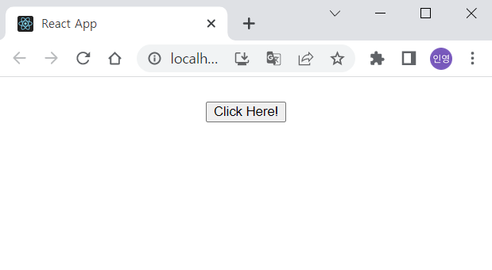

# jero-payments-modal

> A library to design a bottom sheet(or modal) built in React & TypeScript

## Overview

- You can use this library when designing a bottom sheet.
- Just import and use it!

## Version

- Latest version: 0.1.0 (updated in 2023.05.06)
- Major package version
  - "react": "^18.2.0",
  - "react-dom": "^18.2.0",
  - "react-scripts": "^5.0.1",
  - "styled-components": "^5.3.10",
  - "typescript": "^4.5.5"

## How to Use

### Installation

```Shell
npm i jero-payments-modal
```

### Import

```
import { JeroModal } from 'jero-payments-modal';

```

### Usage Example

- Modal when Closed
  
- Modal when Opened
  

```JavaScript
import React, { useState } from 'react';
import './App.css';
import { JeroModal } from 'jero-payments-modal';

function App() {
  const [isModalOpen, setIsModalOpen] = useState(false);
  return (
    <div className='App'>
      <button onClick={() => setIsModalOpen(true)}>하이</button>
      {isModalOpen && <JeroModal onModalClose={setIsModalOpen}>끼룩</JeroModal>}
    </div>
  );
}

export default App;

```

## Component & Props

### Component

```
📦lib
 ┣ 📂JeroModal
 ┃ ┣ 📜index.tsx
 ┃ ┗ 📜styled.tsx
 ┗ 📜index.tsx
```

### Props

```TypeScript
interface ModalProps {
  onModalClose: Dispatch<React.SetStateAction<boolean>>;
  children: JSX.Element;
}

```

| props name   | props type                              |
| ------------ | --------------------------------------- |
| onModalClose | Dispatch<React.SetStateAction<boolean>> |
| children     | JSX.Element                             |

## Source

- [Github Code](https://github.com/inyeong-kang/jero-payments-modal)
- [npm.js](https://www.npmjs.com/package/jero-payments-modal)

## Developer

- [jero-kang](https://github.com/inyeong-kang)
